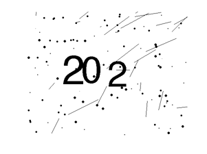
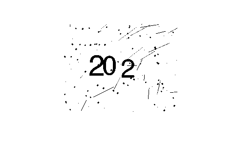
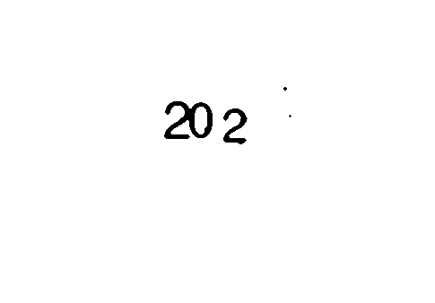
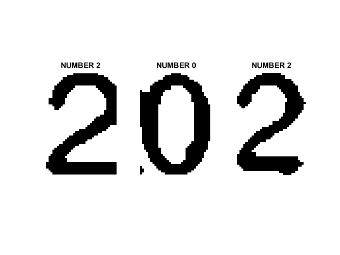

# Classification for Digital Image

> This is an Matlab project for recognizing noised digital image. What we want is a programme that could automatically  recognizing several noised digital image. The inputs are some images like the following picture, the exception is [2, 0, 2].

[中文介绍](README.CN.md)

In this project, we introduced a classification example for number images.  



They are similar to Google CAPTCHAs. 

There are totally 1200 images in folder 'imagedata', and ground truth in file 'labels.txt'.

The task is to make a function called my_classifier.m that decodes three  digits in an image. 

## Environment

[Matlab](https://www.mathworks.com/products/matlab.html ) and [Image Processing Toolbox](https://www.mathworks.com/products/image.html) are ready for your computer.

## Run

1. New a folder named ‘labeledImage’ and run ‘DeNoise.m’
2. New a folder named ‘SplitLabeledImage’ with 3 sub-folders named ‘0’, ‘1’ and ‘2’, then run ‘Split.m’
3. Run ‘trainer.m’ to get trained network ‘net.mat’
4. Run ‘evaluate_classifier.m’

## How does it work

0. An original image is 
   

1. We firstly use threshold to convert image into binary image.  
    

2. Then we use `imclose`  to remove noises.
    

3. We split the denoised image into three parts. In each part, there is a single number.
    
4. We do the same thing for each image and save the split images into the sub-folder `0` , `1` , `2` 
5. We desgin a CNN like this

   ```matlab
   layers = [
       imageInputLayer([50 35 1])
       
       convolution2dLayer(3,8,'Padding','same')
       batchNormalizationLayer
       reluLayer
       
       maxPooling2dLayer(2,'Stride',2)
       
       convolution2dLayer(3,16,'Padding','same')
       batchNormalizationLayer
       reluLayer
       
       maxPooling2dLayer(2,'Stride',2)
       
       convolution2dLayer(3,32,'Padding','same')
       batchNormalizationLayer
       reluLayer
       
       fullyConnectedLayer(3)
       softmaxLayer
       classificationLayer];
   ```
5. We write a script for test images to split them into the size that our clissifer can test. In this project, it is `myclassifier.m`.
6. At last, in `evaluate_classifier.m`, we evaluate our classifier. Note, you may see that the code in this file about the test data is our training data, but you can replace them by yourself.


